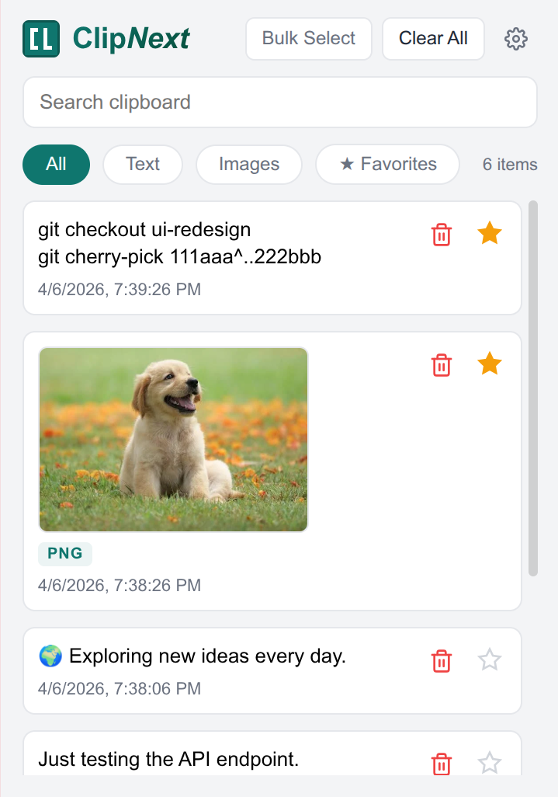

<div align="center">


# Clip*Next*

**Lightning-fast, privacy-first clipboard manager built for developers and students.**

Capture everything you copy — text, screenshots, and images — and access your full history instantly.  
Zero telemetry. Zero cloud. 100% local storage.

[](https://github.com/Aeshp/Clipnext/releases)
[](#)
[](LICENSE)
[](https://github.com/Aeshp/Clipnext/pulls)

</div>

---

## 👀 See It in Action

<div align="center">



*Your clipboard history — organized, searchable, and always one click away.*

</div>

---

## ✨ Features

| | Feature | Description |
|---|---|---|
| 🚀 | **Manifest V3 Architecture** | Modern service worker, offscreen document for clipboard polling, and strict permission scoping. No legacy background pages. |
| 📋 | **Rich Clipboard Capture** | Automatically captures text, screenshots, and copied images in real-time via system clipboard polling. |
| 💾 | **Immortal Favorites** | A dedicated storage tier that protects important snippets from the 7-day expiry and the 50-item rolling cap. Star it, and it lives forever. |
| 🔎 | **Instant Search** | Fuzzy-find any snippet in your history — just start typing and results filter in real-time. |
| 🧹 | **Smart Auto-Cleanup** | Items older than 7 days are automatically purged. Manual single-delete and bulk-delete with a safe confirmation modal. |
| 🔍 | **Filter Chips** | Instantly filter your history by `All`, `Text`, or `Images` with a single tap. |
| ✨ | **Fun Notifications** | A toggleable, randomized toast notification system with custom DOM injection — shows a playful message every time you copy something. |
| 🔄 | **Smart OTA Updates** | A background cron job checks the GitHub Releases API every 24 hours (without rate-limiting your token) and alerts you via a non-intrusive UI badge — no nagging, just a dot. |
| 🎨 | **Developer-First UI** | Custom webkit scrollbars, SVG iconography, a two-view popup router (Main ↔ Settings), and safe destructive-action modals with blur overlays. |

---

## 📦 Installation

### Method 1: Download the Release *(Recommended)*

1. Go to the [**Releases page**](https://github.com/Aeshp/Clipnext/releases) and download the latest **Source code (zip)**.
2. Extract the downloaded `.zip` file to a folder on your computer.
3. Open Chrome and navigate to **`chrome://extensions/`**.
4. Enable **Developer mode** using the toggle in the top-right corner.
5. Click the **Load unpacked** button in the top-left corner.
6. Select the extracted folder — and **pin the extension** to your toolbar! 📌

### Method 2: Clone the Repository *(For Developers)*

```bash
git clone https://github.com/Aeshp/Clipnext.git
```

Then follow **steps 3–6** from Method 1, selecting the cloned `Clipnext` folder.

---

## 🏗️ Architecture & File Structure

```text
Clipnext/
├── manifest.json               # MV3 config — permissions, service worker, content scripts
├── README.md
│
├── assets/
│   └── icons/                  # Extension icons (16, 32, 48, 128px)
│
└── src/
    ├── background/
    │   └── service-worker.js   # Core runtime — alarms, message router, GitHub API polling
    │
    ├── content/
    │   └── content.js          # DOM injection — toast animations, copy-event listener
    │
    ├── injected/
    │   └── injected.js         # Page-world script — clipboard access bridge
    │
    ├── lib/
    │   ├── storage.js          # Storage API wrappers, favorites logic, expiry/GC engine
    │   └── messages.js         # Fun Notification message dictionary
    │
    ├── offscreen/
    │   ├── offscreen.html      # Offscreen document shell
    │   └── offscreen.js        # System clipboard polling (text + images)
    │
    └── popup/
        ├── popup.html          # Extension popup markup
        ├── popup.js            # UI rendering, event delegation, settings router
        └── popup.css           # Styles — dark theme, custom scrollbars, modals
```

---

## 🔒 Privacy

ClipNext is **completely local**. Your clipboard data never leaves your machine.

- ❌ No analytics or telemetry
- ❌ No cloud sync or remote storage
- ❌ No third-party SDKs
- ✅ All data stored in `chrome.storage.local`
- ✅ The only network request is an optional version check to `api.github.com`

---

## 🤝 Contributing

Contributions are welcome! Whether it's a bug fix, a new feature, or UI polish — we'd love your help.

1. **Fork** the repository.
2. Create a feature branch: `git checkout -b feat/your-feature`.
3. Commit your changes: `git commit -m "feat: add your feature"`.
4. Push to the branch: `git push origin feat/your-feature`.
5. Open a **Pull Request**.

> **Tip:** If you're working on a larger change, open an issue first so we can discuss the approach before you invest time coding.

---

## 📄 License

This project is open-source and available under the [**MIT License**](LICENSE).

---

<div align="center">

**Built with ☕ and vanilla JS — no frameworks, no build step, no nonsense.**

</div>
